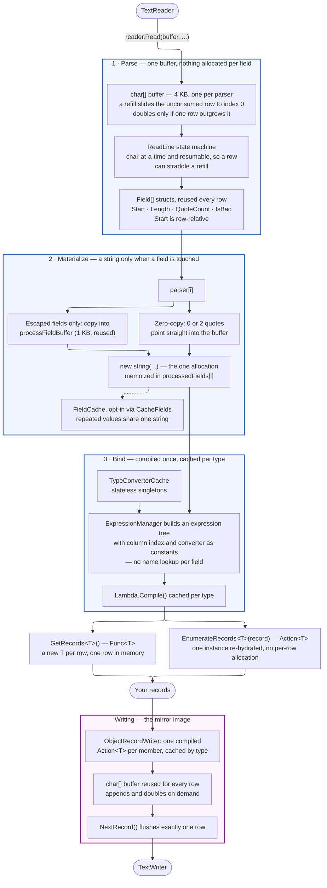

# CsvHelper

[](https://gitter.im/CsvHelper/Lobby?utm_source=badge&utm_medium=badge&utm_campaign=pr-badge&utm_content=badge)
[](#backers)
[](#sponsors) 
<a href="https://www.nuget.org/packages/CsvHelper"></a> 
<a href="https://www.nuget.org/packages/CsvHelper"></a>

A library for reading and writing CSV files. Extremely fast, flexible, and easy to use. Supports reading and writing of custom class objects.

## How It's Fast

CsvHelper keeps CSV parsing cheap by doing three things: reading through **one reusable buffer**, describing fields as **structs instead of strings**, and turning your class mapping into a **compiled delegate** once instead of reflecting per row. Strings are only created for fields you actually read.



A few details the diagram leaves out:

- `Field.Start` is stored **relative to the start of the row**, which is what makes buffer compaction safe — sliding the unconsumed row back to index 0 cannot invalidate the descriptors already recorded for it. Each field also carries an `IsProcessed` flag so a string is built at most once per row.
- `FieldCache` hashes the `char[]` slice directly rather than building an intermediate string to hash, which is what makes deduplicating repeated column values actually cheaper than just allocating.
- `processFieldBuffer` starts at 1 KB and doubles as needed; like the parse buffer, it is never released between rows.
- Trimming never allocates — it adjusts the field's start and length in place.
- Compiled read delegates are cached in a `Dictionary<Type, Delegate>`. On the write side, one `Action<T>` is compiled per member and the set is merged with `Delegate.Combine`, then cached by type hash.

The costly options are opt-in and off by default, so you never pay for them unless you ask: `CacheFields`, `DetectDelimiter` (a one-time scan of the first buffer), `CountBytes`, and `MaxFieldSize`.


## Install

### Package Manager Console

```
PM> Install-Package CsvHelper
```

### .NET CLI Console

```
> dotnet add package CsvHelper
```

## Documentation

http://joshclose.github.io/CsvHelper/

### Building the Documentation

Run the `build-docs.cmd` file.

## License

Dual licensed

Microsoft Public License (MS-PL)

http://www.opensource.org/licenses/MS-PL

Apache License, Version 2.0

http://opensource.org/licenses/Apache-2.0

## Contributing

Want to contribute? Great! Here are a few guidelines.

1. If you want to do a feature, post an issue about the feature first. Some features are intentionally left out, some features may already be in the works, or I may have some advice on how I think it should be done. I would feel bad if time was spent on some code that won't be used.
2. If you want to do a bug fix, it might not be a bad idea to post about it too. I've had the same bug fixed by multiple people at the same time before.
3. All code should have a unit test. If you make a feature, there should be significant tests around the feature. If you do a bug fix, there should be a test specific to that bug so it doesn't happen again.
4. Pull requests should have a single commit. If you have multiple commits, squash them into a single commit before requesting a pull.
5. Try and follow the code styling already in place. If you have ReSharper there is a dotsettings file included and things should automatically be formatted for you.

## Credits

### Contributors

This project exists thanks to all the people who contribute. [[Contribute](CONTRIBUTING.md)].

<a href="https://github.com/JoshClose/CsvHelper/graphs/contributors"></a>

### Sponsors

You can do a one time or recurring donations through [GitHub Sponsors](https://github.com/sponsors/JoshClose)

A huge thanks to the [.NET on AWS Open Source Software Fund](https://github.com/aws/dotnet-foss) for sponsoring CsvHelper!

<a href="https://github.com/aws/dotnet-foss"></a>

Thanks to [Microsoft](https://github.com/microsoft) for being a sponsor!

<a href="https://github.com/microsoft"></a>
